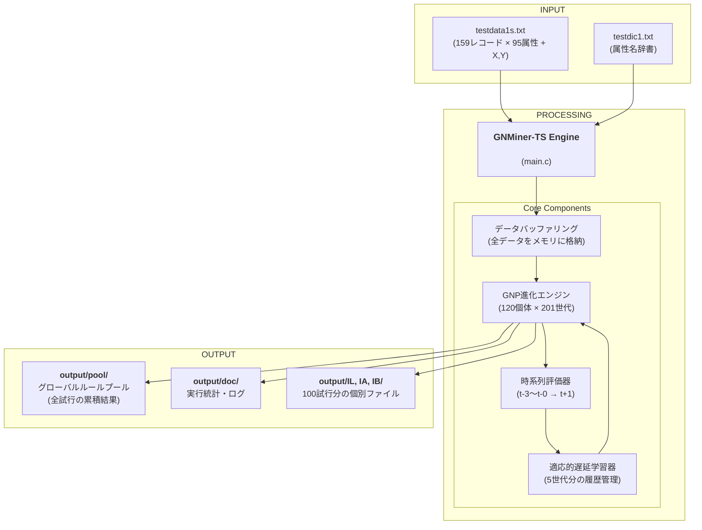
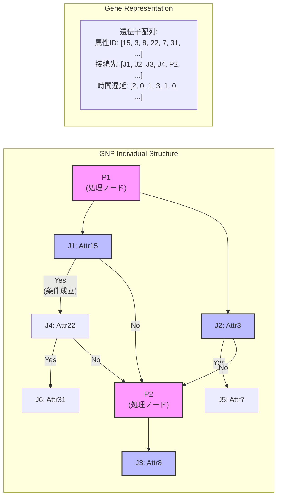
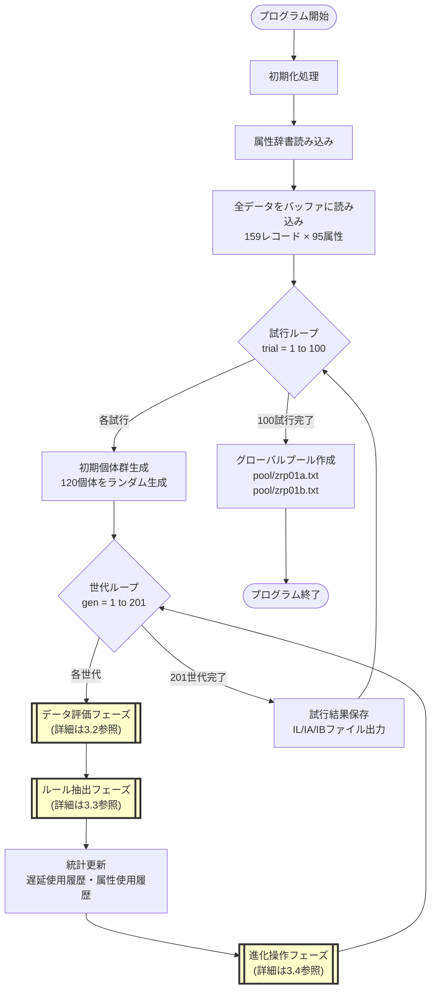
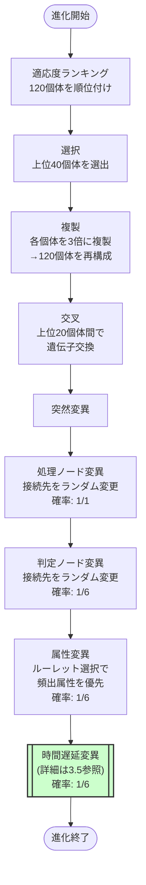

# GNP-based Time-Series Association Rule Mining System (GNMiner-TS)

**遺伝的ネットワークプログラミング（GNP）を用いた時系列アソシエーションルール抽出システム**

## 1. 概要

本プロジェクトは、進化計算手法の一つである**遺伝的ネットワークプログラミング（GNP）**を用いて、時系列データから有用なアソシエーションルールを自動的に発見する、C 言語で実装されたデータマイニングシステムです。

システムの核心は、単なる事象の関連性だけでなく、**「どのくらい過去のデータ（t-d）が未来（t+1）の結果に影響を与えるか」**という時間的な遅延（タイムラグ）`d`を、GNP の進化プロセスを通じて自動的に最適化する点にあります。

現在のバージョン（Phase 3）では、**適応的遅延学習**のメカニズムが導入されており、有望な遅延パターンを学習し、進化の方向性を最適化することで、より効率的に精度の高い時系列ルールを発見することを目指します。

## 2. システムアーキテクチャ

### 2.1 全体処理フロー

本システムの全体的な処理フローは以下の通りです。入力データと属性辞書を読み込み、GNP エンジンが進化計算を実行し、結果としてルールプールや各種ドキュメントを生成します。



### 2.2 GNP ネットワーク構造

GNP は、処理ノード（P）と判定ノード（J）からなるグラフ構造を持ち、このネットワークがルールの前件部を表現します。



## 3. 主要アルゴリズムの詳細

### 3.1 メイン処理ループ



### 3.2 データ評価フェーズ（時系列対応）

```mermaid
flowchart TD
    StartEval([評価開始]) --> SetRange[安全範囲設定<br/>start = 3, end = 158<br/>※遅延と予測のマージン確保]

    SetRange --> TimeLoop{時刻ループ<br/>t = 3 to 157}

    TimeLoop -->|各時刻t| GetFuture[未来値取得<br/>X[t+1], Y[t+1]]

    GetFuture --> IndLoop{個体ループ<br/>i = 0 to 119}

    IndLoop -->|各個体| NodeLoop{処理ノードループ<br/>p = 0 to 9}

    NodeLoop -->|各ノード| InitChain[チェーン初期化<br/>depth = 0]

    InitChain --> ChainEval{判定ノード評価}

    ChainEval --> GetDelay[時間遅延取得<br/>d = gene_delay[node]]

    GetDelay --> CalcIndex[データインデックス計算<br/>index = t - d]

    CalcIndex --> CheckData{data[index][attr] == 1?}

    CheckData -->|Yes| UpdateStats2[統計更新<br/>・match_count++<br/>・X,Y値累積<br/>・次ノードへ]
    CheckData -->|No| BreakChain[チェーン終了]

    UpdateStats2 --> DepthCheck{depth < 7?}

    DepthCheck -->|Yes| ChainEval
    DepthCheck -->|No| NextNode

    BreakChain --> NextNode[次の処理ノードへ]

    NextNode --> NodeLoop
    NodeLoop -->|完了| NextInd[次の個体へ]
    NextInd --> IndLoop
    IndLoop -->|完了| NextTime[次の時刻へ]
    NextTime --> TimeLoop
    TimeLoop -->|完了| CalcMeanVar[平均・分散計算]

    CalcMeanVar --> EndEval([評価終了])

    style GetDelay fill:#ccf,stroke:#333,stroke-width:2px
    style CalcIndex fill:#ccf,stroke:#333,stroke-width:2px
```

### 3.3 ルール抽出フェーズ

```mermaid
flowchart TD
    StartExtract([抽出開始]) --> IndLoop2{個体ループ}

    IndLoop2 -->|各個体| ProcLoop{処理ノードループ}

    ProcLoop -->|各ノード| DepthLoop{深さループ<br/>1 to 8}

    DepthLoop -->|各深さ| CalcSupport[サポート値計算<br/>support = match/negative]

    CalcSupport --> CalcSigma[標準偏差計算<br/>σx, σy]

    CalcSigma --> CheckQuality{品質チェック<br/>support ≥ 0.04?<br/>σx ≤ 0.5?<br/>σy ≤ 0.5?}

    CheckQuality -->|Yes| BuildRule[ルール構築<br/>属性と遅延値をペアで保存]
    CheckQuality -->|No| NextDepth

    BuildRule --> CheckDup{既存ルールと<br/>重複?}

    CheckDup -->|No| SaveRule[新規ルール保存]
    CheckDup -->|Yes| UpdateFitness[適応度更新のみ]

    SaveRule --> LearnDelay[["遅延パターン学習<br/>(詳細は3.5参照)"]]

    LearnDelay --> CalcFitness[適応度計算<br/>F = 属性数 + support×10<br/>+ 2/(σx+0.1) + 2/(σy+0.1) + 20]

    UpdateFitness --> NextDepth[次の深さへ]
    CalcFitness --> NextDepth

    NextDepth --> DepthLoop
    DepthLoop -->|完了| NextProc
    NextProc --> ProcLoop
    ProcLoop -->|完了| NextInd2
    NextInd2 --> IndLoop2
    IndLoop2 -->|完了| EndExtract([抽出終了])

    style LearnDelay fill:#fcc,stroke:#333,stroke-width:2px
```

### 3.4 進化操作フェーズ



### 3.5 適応的遅延学習メカニズム（Phase 3 の核心）

```mermaid
flowchart TD
    subgraph "学習フェーズ (ルール発見時)"
        NewRule([新規ルール発見]) --> CheckQual{高品質ルール?<br/>高サポートor低分散}

        CheckQual -->|Yes| BonusPoint[ボーナス加点<br/>delay_history[d] += 3]
        CheckQual -->|No| NormalPoint[通常加点<br/>delay_history[d] += 1]

        BonusPoint --> UpdateHist[履歴更新]
        NormalPoint --> UpdateHist
    end

    subgraph "活用フェーズ (突然変異時)"
        MutationTrigger([突然変異発生]) --> CalcTotal[全遅延値の<br/>使用頻度合計]

        CalcTotal --> Roulette[ルーレット選択準備<br/>過去5世代分の統計]

        Roulette --> Random[乱数生成<br/>r = rand() % total]

        Random --> SelectDelay{累積頻度で選択}

        SelectDelay -->|"t-0: 頻度10"| D0[d=0を選択]
        SelectDelay -->|"t-1: 頻度25"| D1[d=1を選択]
        SelectDelay -->|"t-2: 頻度35"| D2[d=2を選択]
        SelectDelay -->|"t-3: 頻度15"| D3[d=3を選択]

        D0 --> Apply[遺伝子に適用]
        D1 --> Apply
        D2 --> Apply
        D3 --> Apply
    end

    subgraph "履歴管理"
        Every5Gen([5世代ごと]) --> Shift[履歴配列シフト<br/>古い情報を削除]

        Shift --> Refresh[リフレッシュ<br/>探索の多様性維持]
    end
```

## 4. 主な特徴

### 4.1 時系列ルールの表現形式

本システムが発見するルールは以下の形式を持ちます：

```
IF   A1(t-d1) = 1 ∧ A2(t-d2) = 1 ∧ ... ∧ An(t-dn) = 1
THEN X(t+1) ∈ [μx ± σx], Y(t+1) ∈ [μy ± σy]
```

ここで：

- `Ai`: 属性（条件）
- `di`: 各属性の時間遅延（0〜3）
- `X, Y`: 予測対象の 2 次元連続値
- `μ, σ`: 平均と標準偏差

### 4.2 適応的学習の効果

Phase 3 の適応的遅延学習により、以下の効果が期待されます：

1. **探索効率の向上**: 有望な遅延パターンを優先的に探索
2. **収束速度の改善**: 良質なルールをより早期に発見
3. **ドメイン知識の自動獲得**: データに内在する時間的パターンを学習

## 5. ディレクトリ構造

プログラムを実行すると、`output`ディレクトリ以下に結果ファイルが体系的に保存されます。

```
output/
├── IL/        (Individual List: 試行ごとのルールリスト)
│   ├── IL01000.txt
│   ├── IL01001.txt
│   └── ...
├── IA/        (Individual Analysis: 試行ごとの分析レポート)
│   ├── IA01000.txt
│   ├── IA01001.txt
│   └── ...
├── IB/        (Individual Backup: 試行ごとのバックアップ)
│   ├── IB01000.txt
│   ├── IB01001.txt
│   └── ...
├── pool/      (Global Rule Pool: 全試行で発見されたルールの集積場所)
│   ├── zrp01a.txt  (属性名表記)
│   └── zrp01b.txt  (数値ID表記)
└── doc/       (Documentation: 実行サマリーやログ)
    ├── zrd01.txt   (実行統計)
    └── zrmemo01.txt (実行ログ)
```

## 6. ファイル詳細

### 6.1 入力ファイル

| ファイル名       | 形式           | 説明                                                                      |
| :--------------- | :------------- | :------------------------------------------------------------------------ |
| `testdata1s.txt` | タブ区切り     | 学習用データセット。各行が 1 レコード（1 時刻）に対応。95 属性 + X,Y 値。 |
| `testdic1.txt`   | スペース区切り | 属性辞書。属性 ID と属性名を対応付ける。                                  |

### 6.2 主要な出力ファイル

| パス                     | 説明                                                                                 | サンプル                         |
| :----------------------- | :----------------------------------------------------------------------------------- | :------------------------------- |
| `output/pool/zrp01a.txt` | **グローバルルールプール（メイン出力）**。全試行で発見されたユニークなルールを格納。 | `15(t-2) 3(t-0) 8(t-1) ...`      |
| `output/doc/zrd01.txt`   | 実行統計。試行ごとのルール数、高サポート数、低分散数を記録。                         | `Trial Rules HighSup LowVar ...` |
| `output/IL/IL*****.txt`  | 個別試行のルールリスト。時間遅延付きで記録。                                         | 各試行で発見された全ルール       |
| `output/IA/IA*****.txt`  | 世代ごとの進捗レポート。適応度の推移を記録。                                         | `Generation Rules HighSup ...`   |

## 7. ビルドと実行

### 7.1 必要環境

- **OS**: Linux/Unix 系（Windows WSL 可）
- **コンパイラ**: GCC 4.8 以降
- **メモリ**: 512MB 以上推奨
- **ディスク**: 100MB 以上の空き容量

### 7.2 コンパイルと実行

```bash
# 1. コンパイル
gcc -o gnminer_ts main.c -lm -O2

# 2. 実行
./gnminer_ts

# 3. 実行状況の確認（別ターミナル）
watch -n 1 'ls -la output/IL/ | wc -l'
```

### 7.3 実行時間の目安

- **1 試行あたり**: 約 30 秒〜1 分（データサイズと CPU 性能に依存）
- **全 100 試行**: 約 50 分〜100 分
- **並列実行**: 対応していません（将来的な拡張予定）

## 8. パラメータ詳細

### 8.1 時系列パラメータ

| パラメータ              | デフォルト値 | 説明                     | 推奨範囲 |
| :---------------------- | :----------- | :----------------------- | :------- |
| `TIMESERIES_MODE`       | `1`          | 時系列モードの有効化     | 1 固定   |
| `ADAPTIVE_DELAY`        | `1`          | 適応的学習の有効化       | 1 推奨   |
| `MAX_TIME_DELAY_PHASE3` | `3`          | 最大時間遅延（t-0〜t-3） | 2〜5     |
| `PREDICTION_SPAN`       | `1`          | 予測スパン（t+1）        | 1〜3     |

### 8.2 進化計算パラメータ

| パラメータ   | デフォルト値 | 説明         | 推奨範囲 |
| :----------- | :----------- | :----------- | :------- |
| `Generation` | `201`        | 世代数       | 100〜500 |
| `Nkotai`     | `120`        | 個体群サイズ | 60〜200  |
| `Npn`        | `10`         | 処理ノード数 | 5〜20    |
| `Njg`        | `100`        | 判定ノード数 | 50〜200  |
| `Nmx`        | `7`          | 最大ルール長 | 5〜10    |

### 8.3 ルール品質パラメータ

| パラメータ | デフォルト値 | 説明                 | 推奨範囲   |
| :--------- | :----------- | :------------------- | :--------- |
| `Minsup`   | `0.04`       | 最小サポート値       | 0.01〜0.10 |
| `Maxsigx`  | `0.5`        | X 方向の最大標準偏差 | 0.1〜1.0   |
| `Maxsigy`  | `0.5`        | Y 方向の最大標準偏差 | 0.1〜1.0   |

### 8.4 突然変異率

| パラメータ    | デフォルト値 | 説明                    | 推奨範囲 |
| :------------ | :----------- | :---------------------- | :------- |
| `Muratep`     | `1`          | 処理ノード変異率（1/1） | 1〜3     |
| `Muratej`     | `6`          | 判定接続変異率（1/6）   | 5〜10    |
| `Muratea`     | `6`          | 属性変異率（1/6）       | 5〜10    |
| `Muratedelay` | `6`          | 遅延変異率（1/6）       | 5〜10    |

## 9. 出力ルールの解釈

### 9.1 ルール形式

出力ファイル（`zrp01a.txt`）の各行は 1 つのルールを表します：

```
15(t-2)  3(t-0)  8(t-1)  0  0  0  0  0  12.34  0.45  -5.67  0.32  25  156  1  1
```

### 9.2 フィールドの意味

| 位置 | フィールド       | 説明                                      |
| :--- | :--------------- | :---------------------------------------- |
| 1-8  | 前件部           | 属性 ID(時間遅延)の形式。0 は該当属性なし |
| 9    | X 平均           | 条件成立時の X の平均値                   |
| 10   | X 標準偏差       | 条件成立時の X のばらつき                 |
| 11   | Y 平均           | 条件成立時の Y の平均値                   |
| 12   | Y 標準偏差       | 条件成立時の Y のばらつき                 |
| 13   | サポート数       | ルールが成立した回数                      |
| 14   | 負例数           | 評価された総回数                          |
| 15   | 高サポートフラグ | 1:高サポートルール                        |
| 16   | 低分散フラグ     | 1:低分散ルール                            |

### 9.3 ルールの解釈例

```
ルール: 15(t-2) ∧ 3(t-0) ∧ 8(t-1) → X=12.34±0.45, Y=-5.67±0.32
```

**解釈**:

- 属性 15 が 2 時点前に発生し
- 属性 3 が現在発生し
- 属性 8 が 1 時点前に発生した場合
- 1 時点後の X は約 12.34（標準偏差 0.45）
- 1 時点後の Y は約-5.67（標準偏差 0.32）
  となる傾向がある

## 10. トラブルシューティング

### 10.1 よくある問題と対処法

| 問題                   | 原因                   | 対処法                                |
| :--------------------- | :--------------------- | :------------------------------------ |
| セグメンテーション違反 | メモリ不足             | `Nkotai`や`Njg`を減らす               |
| ルールが発見されない   | 制約が厳しすぎる       | `Minsup`を下げる、`Maxsigx/y`を上げる |
| 実行が遅い             | パラメータが大きすぎる | `Generation`や`Ntry`を減らす          |
| ファイルが見つからない | パス設定ミス           | カレントディレクトリを確認            |

### 10.2 デバッグモード

コンパイル時に`-DDEBUG`フラグを追加すると、詳細な実行ログが出力されます：

```bash
gcc -o gnminer_ts main.c -lm -O2 -DDEBUG
```

## 11. 応用例

### 11.1 株価予測

時系列株価データに適用し、以下のようなルールを発見できます：

- 「取引量増加(t-2) ∧ RSI 低下(t-1) → 価格上昇(t+1)」

### 11.2 センサーデータ分析

IoT センサーの異常検知：

- 「温度上昇(t-3) ∧ 振動増加(t-1) → 故障リスク(t+1)」

### 11.3 交通流予測

交通量の予測：

- 「月曜日(t-0) ∧ 雨天(t-0) ∧ 前日渋滞(t-1) → 渋滞発生(t+1)」

## 12. 今後の拡張予定

- **Phase 4**: 多変量時系列への対応（3 次元以上）
- **Phase 5**: 分散処理による高速化
- **Phase 6**: リアルタイム学習機能の追加

## 13. 参考文献

1. K. Hirasawa et al., "Association Rule Mining with Genetic Network Programming," IEEE Trans. on Systems, Man, and Cybernetics, 2006.
2. K. Shimada et al., "Time-Related Association Rule Mining with Genetic Network Programming," SICE Journal, 2010.
3. 平澤宏太郎、"進化技術ハンドブック 第 III 巻 応用編"、近代科学社、2010 年。

## 14. ライセンスと連絡先

本プロジェクトは研究目的で公開されています。商用利用の際はご相談ください。

---

_Document Version: 3.0 (Phase 3 Implementation)_  
_Last Updated: 2024_
